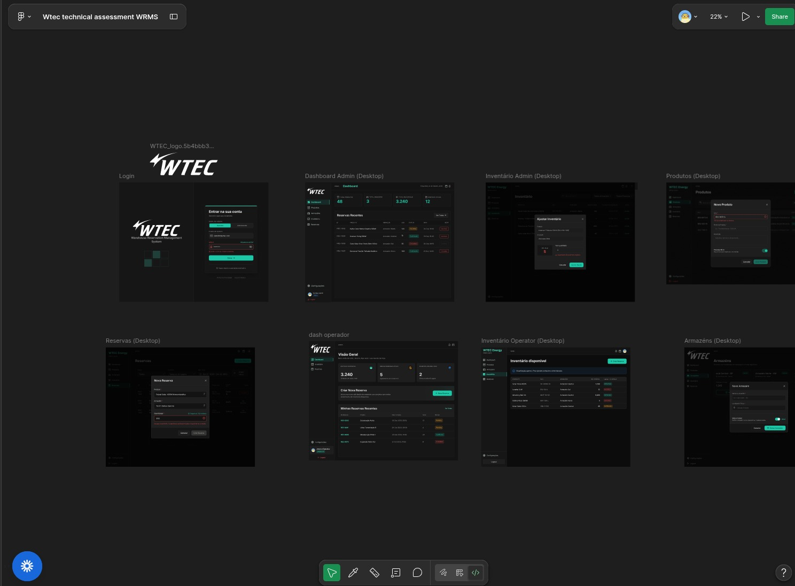
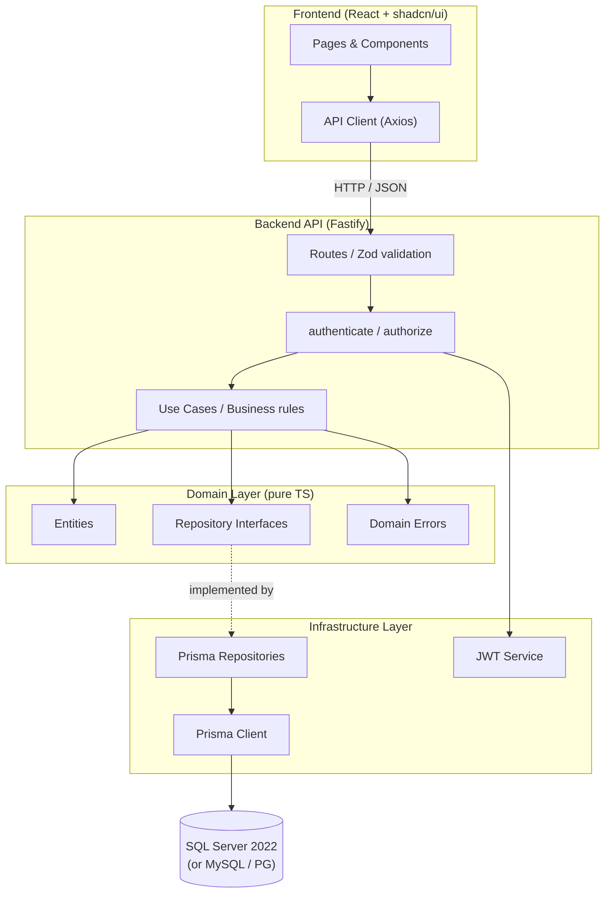

# WRMS — Warehouse Reservation Management System

A full-stack warehouse management application for tracking inventory and managing product
reservations across multiple warehouses. Built with TypeScript end-to-end.

> **Deep dive into architecture, scaling, DB swappability, and trade-offs →**
> [`backend/README.md`](./backend/README.md)

<p align="center">
  
</p>

> Built pixel-by-pixel from the [Figma reference](https://www.figma.com/design/idNN29HocMNZAPIzPnUnBB/Wtec-technical-assessment-WRMS?node-id=0-1&t=KFTCkeIEqVoQfAQh-1) —
> custom dark theme with exact Figma hex values (`#1CC8A8` primary, `#131313` background, `#161616` cards)
> implemented in Tailwind CSS v4 + shadcn/ui.

---

## Stack

| Layer | Technology |
|---|---|---|
| Runtime | Bun |
| Backend | Fastify 5 — [detalhes](./backend/README.md) |
| Frontend | React + shadcn/ui (custom) + Tailwind CSS v4 + Vite — [detalhes](./frontend/README.md) |
| ORM | Prisma 7 (adapter-based, swappable) |
| Database | SQL Server 2022 (Docker) — swappable to MySQL/PG |
| Auth | JWT (HS256) |
| Validation | Zod 4 |
| Tests | Vitest + Supertest |
| Linting | Biome |

---

## Quick Start

### Full stack with Docker (recommended)

```bash
docker compose up --build
```

| Service | URL |
|---------|-----|
| Frontend | `http://localhost:8085` |
| Backend API | `http://localhost:3334` |
| Swagger UI | `http://localhost:3334/documentation` |
| SQL Server | `localhost:1433` |

The entrypoint creates the database, runs migrations, and seeds data automatically.

### Local development

```bash
# Terminal 1 — SQL Server
docker compose up -d db

# Terminal 2 — Backend
cd backend && cp .env.example .env
bun install && bunx prisma db push && bunx prisma db seed && bun run dev

# Terminal 3 — Frontend
cd frontend && cp .env.example .env
bun install && bun run dev
```

### Credenciais de seed

| Role | Email | Password |
|-------|-------|-------|
| Admin | admin@wtec.com | Admin@123 |
| Operator | operator@wtec.com | Operator@123 |

---

## API

**13 endpoints** across 6 modules. Interactive OpenAPI 3.0.3 spec at `http://localhost:3334/documentation`.

| Module | Endpoints | Roles |
|--------|-----------|-------|
| Auth | `POST /api/auth/login` | Public |
| Products | `GET`, `POST`, `PUT` | Admin |
| Warehouses | `GET`, `POST` | Admin (GET open to Operator) |
| Inventory | `GET`, `PUT` | Admin + Operator |
| Reservations | `GET`, `POST`, `PUT /:id/cancel` | Admin + Operator |
| Dashboard | `GET /api/dashboard` | Admin + Operator |

---

## Arquitetura



Clean architecture with pure TypeScript domain — swap the Prisma adapter and connection string to migrate from
SQL Server to MySQL or PostgreSQL without changing business logic.

---

## Documentation

| Resource | Contents |
|---------|-------------|
| [`backend/README.md`](./backend/README.md) | Full system design, 4 Mermaid diagrams, scaling, trade-offs |
| [`frontend/README.md`](./frontend/README.md) | Frontend architecture, feature-slices, design system, auth flow, testing |
| [`frontend/docs/api-contract.md`](./frontend/docs/api-contract.md) | Complete API contract with curl examples, schemas, seed data |
| [`backend/docs/database-schema.md`](./backend/docs/database-schema.md) | ER diagram and modeling notes |
| `http://localhost:3334/documentation` | Interactive Swagger UI |
| [Figma Design](https://www.figma.com/design/idNN29HocMNZAPIzPnUnBB/Wtec-technical-assessment-WRMS?node-id=0-1&t=KFTCkeIEqVoQfAQh-1) | Visual layout reference |

---

## AI Usage

Claude Code was used as a development tool for architectural planning,
scaffolding, business rules review, documentation research (Context7) and testing suggestions.
All engineering, implementation and code review decisions were made by the developer.
