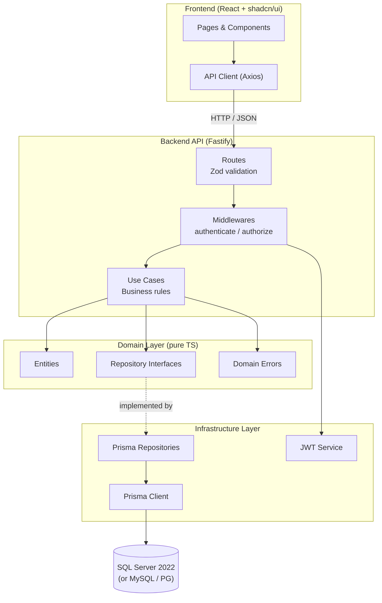

# WRMS — Warehouse Reservation Management System

A full-stack warehouse management application for tracking inventory and managing product
reservations across multiple warehouses. Built with TypeScript end-to-end.

> **Deep dive into architecture, scaling, DB swappability, and trade-offs →**
> [`backend/README.md`](./backend/README.md)

---

## Stack

| Layer | Technology |
|---|---|---|
| Runtime | Bun |
| Backend | Fastify 5 — [see backend README](./backend/README.md) |
| Frontend | React + shadcn/ui (custom) + Tailwind CSS v4 + Vite — [see frontend README](./frontend/README.md) |
| ORM | Prisma 7 (adapter-based, swappable) |
| Database | SQL Server 2022 (Docker) — swappable to MySQL/PG |
| Auth | JWT (HS256) |
| Validation | Zod 4 |
| Tests | Vitest + Supertest |
| Linting | Biome |

---

## Quick Start

```bash
docker compose up -d                    # start SQL Server
cd backend && cp .env.example .env
bun install && bunx prisma db push && bun run dev   # API at :3333
cd frontend && cp .env.example .env
npm install && npm run dev              # UI at :5173
```

### Seed users

| Role | Email | Password |
|------|-------|----------|
| Admin | admin@wtec.com | 123456 |
| Operator | operator@wtec.com | 123456 |

---

## API

The API has **13 endpoints** across 6 modules. Full OpenAPI 3.0.3 spec available at:

```
http://localhost:3333/documentation
```

Click **Authorize** (lock icon), paste a JWT token from `POST /api/auth/login`,
then test every endpoint interactively.

### Auth (public)

`POST /api/auth/login` — authenticate and receive a JWT token. The response never includes
`passwordHash` — only `id`, `email`, and `role`.

### Products (Admin only)

| Endpoint | Description |
|---|---|
| `GET /api/products` | List all products |
| `GET /api/products/:id` | Get product by ID |
| `POST /api/products` | Create a product (unique SKU required) |
| `PUT /api/products/:id` | Update product name, description, or active status |

### Warehouses

| Endpoint | Description | Roles |
|---|---|---|
| `GET /api/warehouses` | List all warehouses | Admin, Operator |
| `POST /api/warehouses` | Create a warehouse | Admin |

### Inventory

| Endpoint | Description | Roles |
|---|---|---|
| `GET /api/inventory` | List stock levels across all warehouses | Admin, Operator |
| `PUT /api/inventory` | Set absolute stock quantity for a product×warehouse pair | Admin |

### Reservations

| Endpoint | Description | Roles |
|---|---|---|
| `GET /api/reservations` | Full reservation history | Admin, Operator |
| `POST /api/reservations` | Reserve stock (debits inventory, validates active product/warehouse + stock) | Admin, Operator |
| `PUT /api/reservations/:id/cancel` | Cancel a reservation (restores stock) | Admin, Operator |

### Dashboard

| Endpoint | Description | Roles |
|---|---|---|
| `GET /api/dashboard` | Metrics + low-stock alerts + recent reservations + per-warehouse breakdown | Admin, Operator |

All error responses follow the same format:

```json
{
  "error": "ERROR_CODE",
  "message": "Human-readable description.",
  "statusCode": 422
}
```

---

## Architecture



The backend uses **clean architecture** with strict layer separation. The domain layer is
pure TypeScript with zero framework imports — repository interfaces are contracts implemented
by Prisma in the infrastructure layer. This makes the database swappable: change the Prisma
adapter (`PrismaMssql` → `PrismaMysql` / `PrismaPg`) and connection string, and the system
works with a different database. No business logic changes needed.

---

## End-to-End Flow (Reservation Example)

1. User logs in → `POST /api/auth/login` → receives JWT
2. User selects a product and warehouse → `POST /api/reservations`
3. Server validates:
   - Body schema via Zod (400 if invalid)
   - JWT via authenticate middleware (401 if missing/invalid)
   - Role via authorize middleware (403 if wrong role)
   - Product exists and is active
   - Warehouse exists and is active
   - Sufficient stock in the product×warehouse inventory
4. If all checks pass: stock is debited, reservation created (status: `Pending`), response 201
5. User can cancel → `PUT /api/reservations/:id/cancel` → stock restored, status → `Cancelled`

Concurrent reservation attempts on the same inventory use **Serializable transactions** with
automatic retry on write conflict — guaranteeing no oversell.

---

## Documentation

| Resource | What you'll find |
|---|---|---|
| [`backend/README.md`](./backend/README.md) | Full system design, 4 Mermaid diagrams, scaling, DB swappability, trade-offs, setup |
| [`frontend/README.md`](./frontend/README.md) | Frontend architecture, feature-slice layout, design system, auth flow, responsive strategy, testing |
| [`frontend/docs/api-contract.md`](./frontend/docs/api-contract.md) | Complete API contract with curl examples, schemas, seed data |
| [`backend/docs/database-schema.md`](./backend/docs/database-schema.md) | ER diagram and modeling notes |
| `http://localhost:3333/documentation` | Interactive Swagger UI (try endpoints live) |
| [Figma Design](https://www.figma.com/design/idNN29HocMNZAPIzPnUnBB/Wtec-technical-assessment-WRMS?node-id=0-1&t=KFTCkeIEqVoQfAQh-1) | UI reference — custom dark theme implemented pixel-by-pixel in shadcn/ui |

---

## Assumptions & Trade-offs (summary)

See the [backend README](./backend/README.md#trade-offs) for the full breakdown with cost/benefit analysis.

- String roles/enums (SQL Server constraint)
- No refresh token (internal system)
- No pagination (scope-appropriate)
- No WebSocket (polling is sufficient)
- Serializable isolation (correctness over throughput)
- User not linked to reservation (PRD scope)
- No cache (stock consistency critical)
- `GET /api/warehouses` opened to Operator (the reservation form needs the dropdown)
- No public registration endpoint (seed-only users — internal tool, not a public product)

---

## MySQL → SQL Server (Optional Discussion Topic)

The assessment includes an optional discussion: if the company acquired another business whose
product catalog lives in MySQL, how would product data be synchronized and kept consistent? No
implementation is included — see the
[backend README](./backend/README.md#mysql--sql-server-synchronization-optional-discussion-topic)
for the full breakdown: one-time ETL migration, CDC-based continuous sync, and `externalId` + `sku`
as the consistency keys between the two systems.

---

## AI Usage

Claude Code was used as the primary development harness for architecture planning,
scaffolding, business rule review, documentation research (Context7), and test suggestions.
All engineering decisions, implementation, and code review were performed by the developer.
