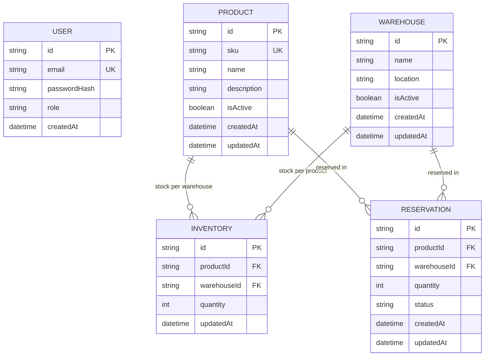

# Database Model — WRMS

## Modeling notes

- `INVENTORY` has a composite unique key `(productId, warehouseId)` — one stock record per product × warehouse combination.
- `PRODUCT.sku` and `USER.email` are unique.
- `RESERVATION.status` and `USER.role` are `String`, not Prisma `enum` — the `sqlserver` connector doesn't support native Prisma enums. Valid values (`Pending/Confirmed/Cancelled`, `Admin/Operator`) are validated via Zod at the API layer.
- There's no relation between `USER` and `RESERVATION`/`INVENTORY` — the PRD doesn't associate the authenticated user with the reservation they create; the JWT is only used for authentication/authorization.
- Missing an `INVENTORY` row for a product × warehouse combination is treated as quantity `0` by the business rule (no pre-created "zero" row).
